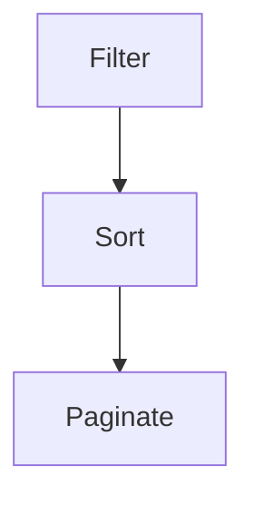

<p align="center">
  
</p>

# ☄️ Effector FSP



```ts
const $todos = createStore<Todo[]>([]);
```

#### Filter

```ts
const filters = createFilters($todos, (todo, field, value) =>
  String(todo[field]).toLowerCase().includes(value.toLowerCase())
);
```

#### Sorting

```ts
const sorting = createSorting({
  $allRecords: filters.$filtredRecords,
  comparator: todoComparator,
  initialField: 'id' as keyof Todo,
  initialOrder: 'desc',
});
```

#### Pagination

```ts
const pagination = createPagination(sorting.$sortedRecords, 10);
```
